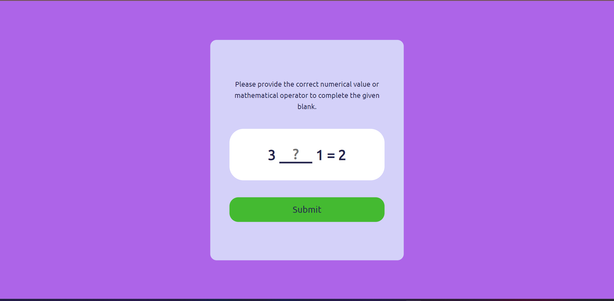

# **Math_Game** 

---

 

## **Description 📃**
This is a game based on simple mathematics.
- 

## **functionalities 🎮**

The user has to fill the blank space with a correct integer or operator. If the user will enter the correct integer or operator then a message will shown stating congrats you have entered correct answer and if not then another message will display stating sorry you have entered wrong answer and a restart button also to restart the game.
 

- 
 

## **How to play? 🕹️**

On clicking the start button on the screen shown to the user, the user will get a mathematical equation with a blank space.
The user has to fill that blank space with appropriate integers or operators. Then a user clicks the submit button after entering their response.
After clicking the submit button, a result screen is shown. On the result screen, we display the result and a restart button.
- 

 

## **Screenshots 📸**

 

 

 

## **Working video 📹**
<!-- add your working video over here -->
