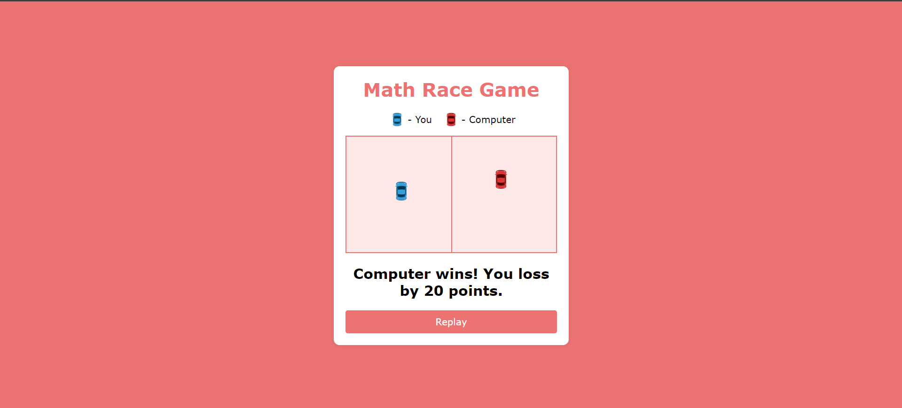

# **Math Race Game** 

---

 

## **Description 📃**
- The game is between the player and the computer.
- Player have to answer math related questions.
- Each play consists of 10 questions.
- If player answers wrong the playes' car will not move forward.
- If player answers correctly, the playes' car moves forward.
- For each question computer's car moves forward randomly.
- After 10 question the game declares the winner based on the distance both cars moved.
- Player can use replay button to start a new game.

 

## **Screenshots 📸**

 
 
