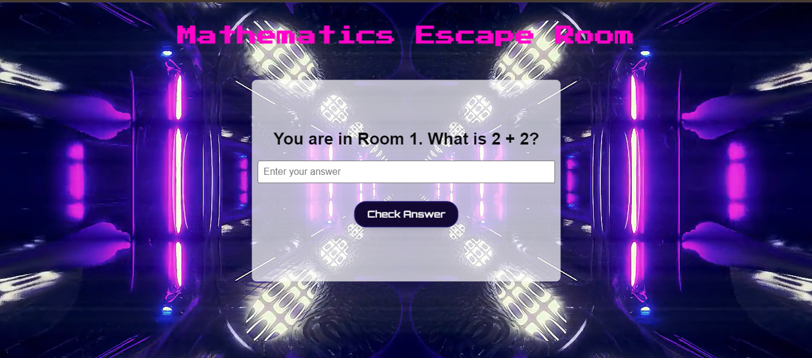

# Mathematics Escape Room Game

Welcome to the Mathematics Escape Room game! Test your math skills and solve puzzles to escape from each room. Each room presents a new mathematical challenge that you must solve to progress to the next room. Are you ready for the challenge?

## Features

- **Interactive Puzzles:** Solve math puzzles to find the key and progress to the next room.
- **Engaging Gameplay:** Each room presents a unique mathematical challenge.
- **Dynamic Interface:** Enjoy a visually appealing interface with an animated background and interactive elements.

## How to Play

### Starting the Game

1. Open `index.html` in your web browser.

### Game Interface

- You will see the game title and the current room description.
- Enter your answer in the input box provided.
- Click the "Check Answer" button or press Enter to submit your answer.

### Solving Puzzles

- Each room presents a math puzzle.
- Enter the correct answer to unlock the next room.
- If the answer is correct, you will proceed to the next room. If not, try again!

### Game Completion

- Successfully escape from all rooms to complete the game.
- A congratulatory message will appear when you finish all rooms.

## Screenshots

 

 

## Technologies Used

- HTML5
- CSS3
- JavaScript
