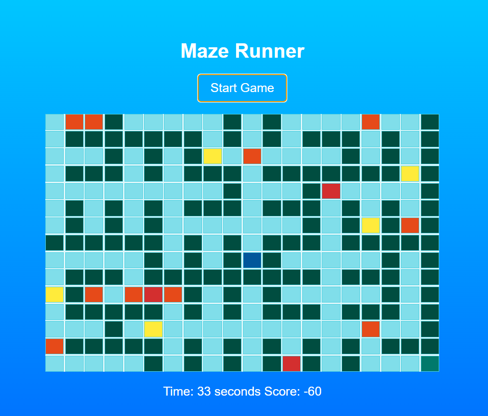

## Maze Explorer
 

## Description 📃

In Maze Explorer, you navigate through a randomly generated maze to reach the exit while avoiding obstacles and collecting items. The game is set in an ocean-themed environment, enhancing the visual experience. Your objective is to find the quickest path to the exit while accumulating points by collecting items.
 

## Functionalities 🎮

    Start Game: Click the "Start Game" button to begin.
    Player Movement: Use the arrow keys to navigate through the maze.
    Maze Layout: The maze is randomly generated each game, ensuring a unique challenge every time.
    Obstacles and Collectibles: Avoid obstacles that decrease your score and collect items to increase your score.
    Timer: The game lasts for 60 seconds.
    Score: Collectibles and power-ups increase your score, while hitting obstacles decreases it.
    Game Over: When time runs out, your final score is displayed with an option to restart the game.

 
Controls ⌨️

    Arrow Keys: Use the arrow keys (↑, ↓, ←, →) to navigate the maze.

 
Scoring System 📈

    Collectibles: Increase your score by 10 points each.
    Power-Ups: Increase your score by 50 points each.
    Obstacles: Decrease your score by 20 points each.
    Exit: Reaching the exit increases your score by 100 points.

 
Difficulty 🚀

    Random Maze Generation: Ensures a unique and challenging layout each time you play.
    Obstacles: Strategically placed obstacles add to the challenge.

 
Game Over 🏁

    Timer: The game lasts for 60 seconds. When the timer reaches zero, the game ends.
    Final Score: Your final score is displayed, with an option to play again.

 

## **Screenshots 📸**

