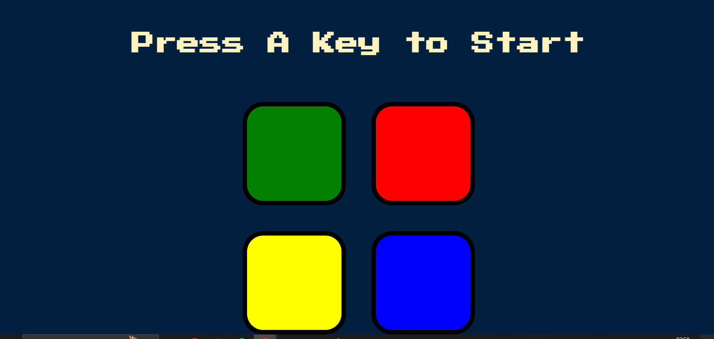

# **Membox** 

---

 

## **Description 📃**
- Game logic and basic description: MemBox is a memory based fun game with infinite levels each getting tougher ever level.
It has 4 boxes all different colors.
level 1: 1 box will glow for a sec and u need to click on it.
level 2 : now 2 boxes will glow and u need to remember the order and click it;
level 3 : now 3 boxes and so on.
Your duty is to remember the pattern of that glow and click it in the same order.
The game doesn't have end its just about when your memory power gives up.
**Test Your Memory Power**

## **functionalities 🎮**
- level 1: 1 box will glow for a sec and u need to click on it.
level 2 : now 2 boxes will glow and u need to remember the order and click it;
level 3 : now 3 boxes and so on.
 

## **How to play? 🕹️**
- Click any button to start
- Try to remember the sequence
- click that sequence in order and you will find yourself in next level
- Happy Playing😉!!

 

## **Screenshots 📸**

 

 

## **Working video 📹**
<!-- add your working video over here -->
