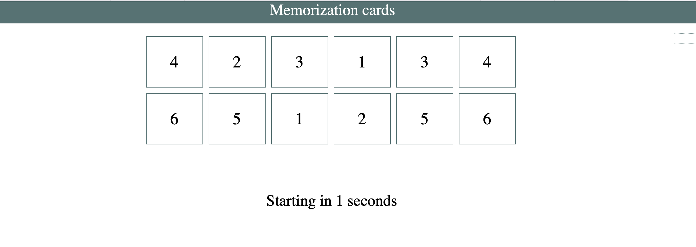

# **Game_Name** 
Memorization cards
---

 

## **Description 📃**

Memorization Cards is a challenging and engaging card game designed to test and improve players' memory skills. The game is suitable for players of all ages and can be played individually or in small groups.
- 

## **functionalities 🎮**
*Setup*: Shuffle the deck of cards and lay them out in a grid formation on the game board, face-down.
*Memory Challenge*: As the game progresses, players need to remember the positions of previously flipped cards to make successful matches in subsequent turns. This is where the memory challenge comes into play, as players strive to memorize the images on the face-down cards.
*Winning*: The game continues until all pairs of cards have been successfully matched. The player with the most matched pairs at the end of the game wins.
 

## **Benefits? 🕹️**
Memorization Cards not only provides entertainment but also offers cognitive benefits, including:

Memory improvement
Concentration and focus enhancement
Visual recognition and pattern recognition skills
Strategic thinking and planning

 

## **Screenshots 📸**

 
 
>

 

