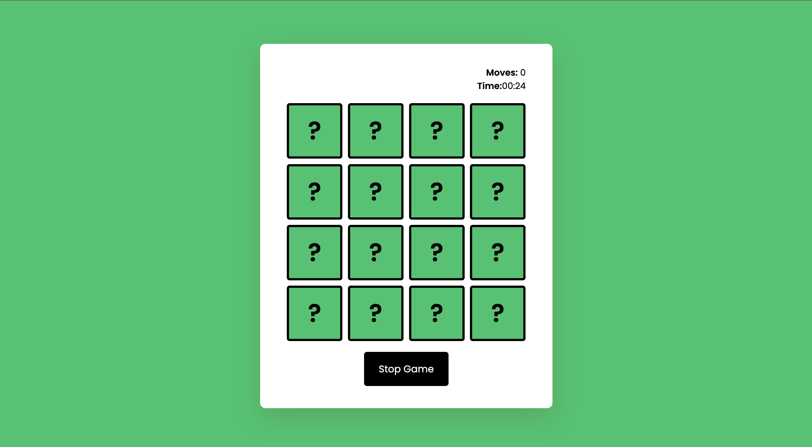

# **Memory_Game** 

---

 

## **Description 📃**
- Memory Game, also known as the Concentration card game or Matching Game is a classic card-flipping game where players test their memory skills by matching pairs of cards. The objective of the game is to flip over two cards at a time and find all the matching pairs within the specified number of moves.
**Test Your Memory Power**

## **functionalities 🎮**
- You will start by flipping over one card
- If the next card you flip matches, both the cards will stay flipped and moves increases by 1. 
- If the next card you flip does not match, the cards flip back.
- The game continues until you match all the cards on the board.
- Timer will be running for 5 minutes, after this the game ends.
 

## **How to play? 🕹️**
- Start by flipping over cards
- Until All pair of cards are matched, the game continues.
- Max Time limit you have is 5 mins.
- Happy Playing😉!!

 

## **Screenshots 📸**

 

 

## **Working video 📹**
<!-- add your working video over here -->
