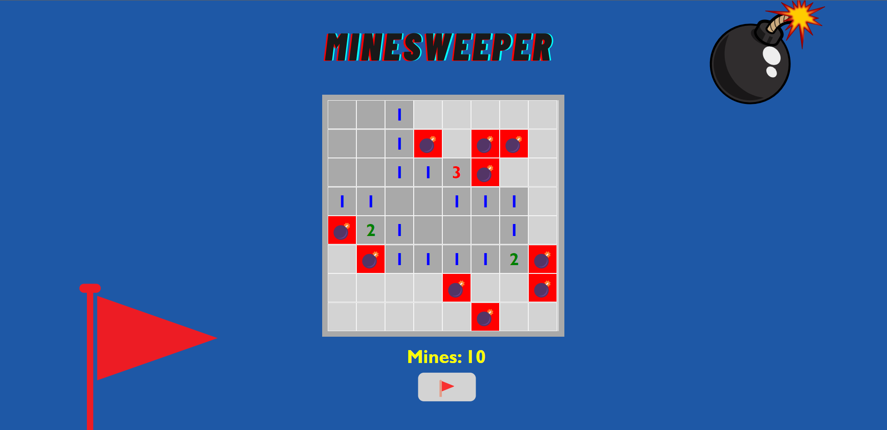

# Minesweeper
---
 

## **Description 📃**
Minesweeper is a classic computer game where the player must uncover squares on a grid while avoiding hidden mines.
- 

## **functionalities 🎮**
The objective of the game is to clear a rectangular grid that contains hidden mines without detonating any of them.
- 
 

## **How to play? 🕹️**
-The game is played on a grid of squares. Each square can be in one of 
  three states: uncovered, covered, or flagged.

-The grid contains hidden mines randomly distributed across the squares.

-The player's task is to uncover all the squares that do not contain mines.

-When a square is uncovered, it reveals a number indicating the total number of  mines in its adjacent squares (including diagonals). If a square has no adjacent   mines, it automatically uncovers all neighboring squares.

-If a player uncovers a square containing a mine, the game ends, and they lose. The position of the mines is revealed, and the player has the option to start a new game.

-To help identify suspected mine locations, the player can place a flag on a covered square they believe contains a mine.

-The game is won when all non-mine squares are uncovered. The player can then start a new game or continue playing to achieve faster completion times.
 

 

## **Screenshots 📸**

 

 

## **Working video 📹**

