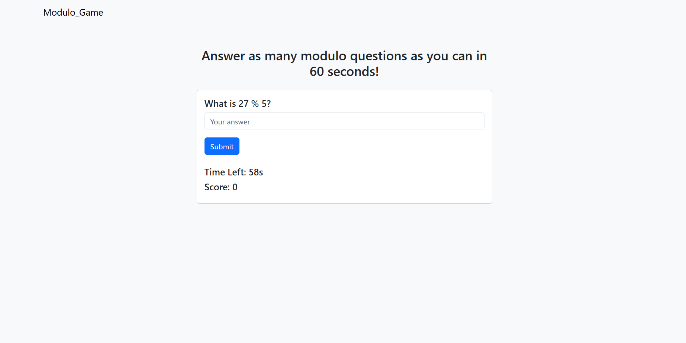

# **Modulo_Game** 

---

 

## **Description 📃**

-Find Modulo of given numbers.
-This is time based game.
-User needs to answer max quations.

## **functionalities 🎮**
  
-In 60s User needs to give max right answer.
-Point counting.
-Display Correct answer.
-Giver Alert on wrong answer.

 

## **How to play? 🕹️**
-When you open page your timer start.
-Input your answer and submit.
-If it is correct your score counts.

 

## **Screenshots 📸**

 

 

