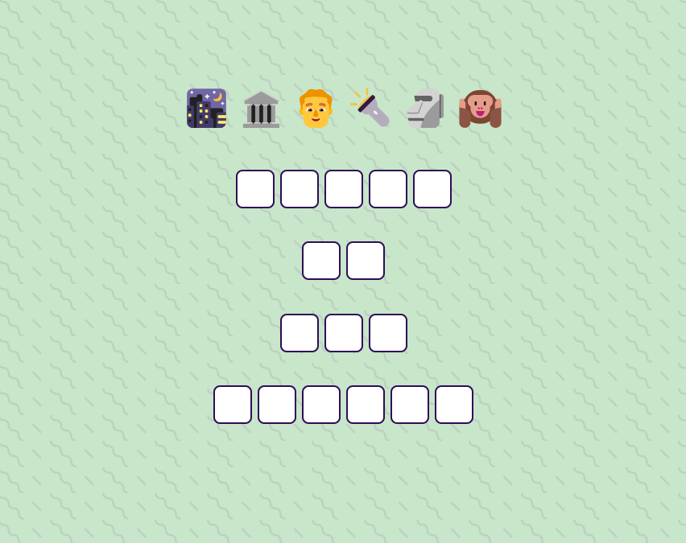

# **Movie_Name** 

---

 

## **Description 📃**
<!-- add your game description here  -->
- "Guess The Movie" is a mini CSS game designed to test your knowledge of popular movies. The objective of the game is to correctly identify the title of the movie based on a series of visual clues displayed on the screen.

## **functionalities 🎮**
<!-- add functionalities over here -->
- **Visual clues**: The game relies on visual cues to represent different movies, challenging players to decipher the hints and guess the correct titles.
- **Guessing mechanism**: Players can input their guesses by clicking on a square and typing their answer, making it interactive and engaging.
- **Instant feedback**: The game provides immediate feedback by revealing the correct movie title and indicating whether the guess was correct or incorrect.
- **CSS-based design**:The game's visuals and interactions are created using CSS (Cascading Style Sheets), showcasing the power of CSS in creating interactive experiences.
 

## **How to play? 🕹️**
<!-- add the steps how to play games -->
- Study the visual clues presented in each square, such as colors, shapes, and patterns.
- Based on the visual clues, try to guess the title of the movie associated with each square.
- Type in your guess and press Enter or click on the "Submit" button.
- If your guess is correct, the square will reveal the movie title and turn green.
- Continue guessing the movie titles for all the squares until you have completed the grid.

 

## **Screenshots 📸**

 
<!-- add your screenshots like this -->
<!--  -->

 

## **Working video 📹**
<!-- add your working video over here -->