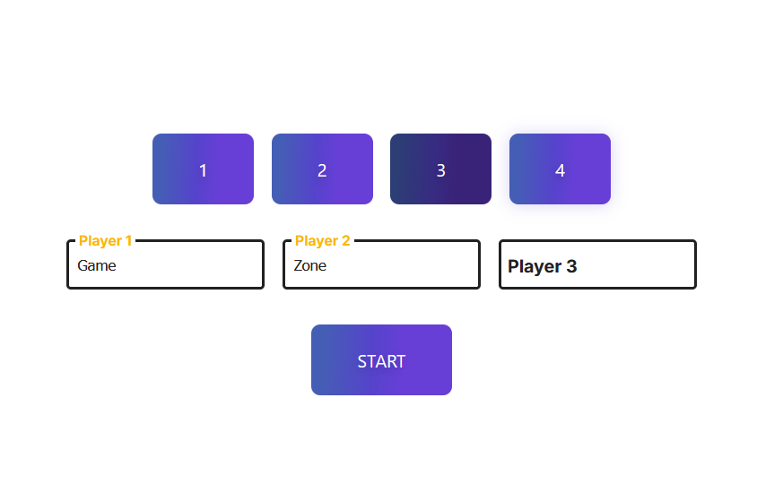
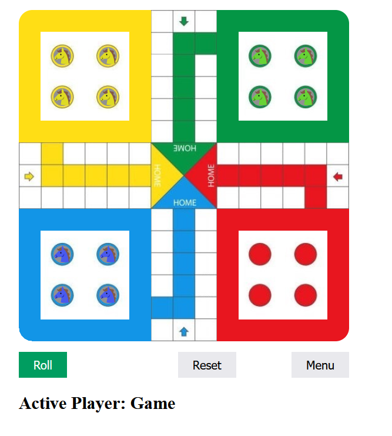

# **Multiplayer Ludo Game** 

---

 

## **Description 📃**
A multiplayer Ludo game for 2 to 4 players
- 

## **functionalities 🎮**
The game can be played by up to 4 players
Players can choose their nicknames
No safe zone
- 
 

## **How to play? 🕹️**
Each player has 4 counters,
The player must roll a "6" to be allowed to remove a pawn from the base,
The player may replay once he has rolled a "6",
The player must make each of his pawns complete a full turn and enter the home,
When an enemy pawn arrives on the square we occupy, our pawn returns to the base.
- 

 

## **Screenshots 📸**

 
Menu

 
Game

