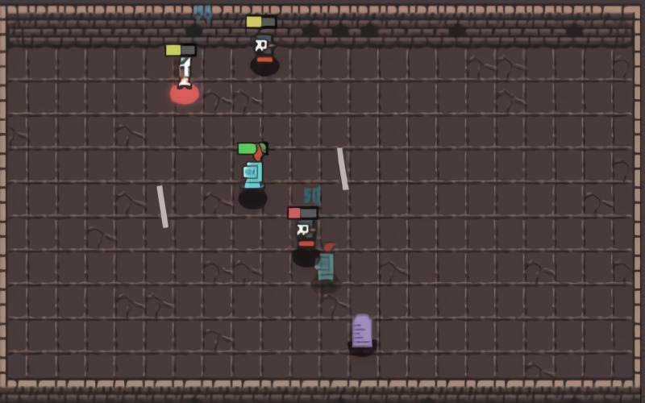

# **Noegnud** 

---

 

## **Description 📃**
- Noegnud is a tiny dungeon crawler in which you started with a randomly skilled hero on the bottom most floor. - After every second finished round you'll have to remove one of your skills and make it all the BACK to the top of the dungeon.

## **How to play? 🕹️**
- Controls:
	- Move - WASD or Arrow Keys
	- Pause - P
	- Can be played on Smartphones also
	
 

## **Screenshots 📸**

 

 
