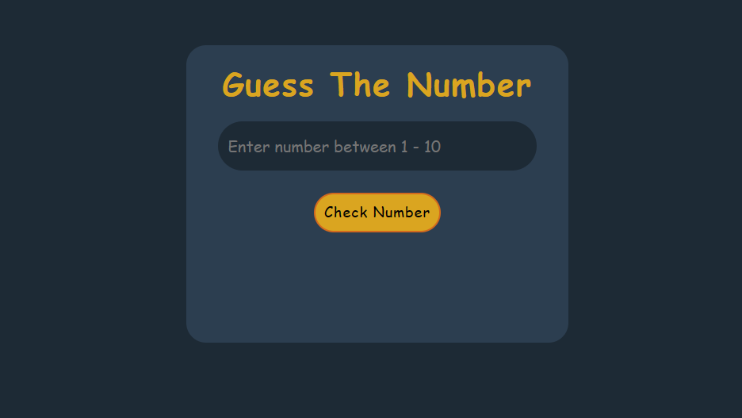
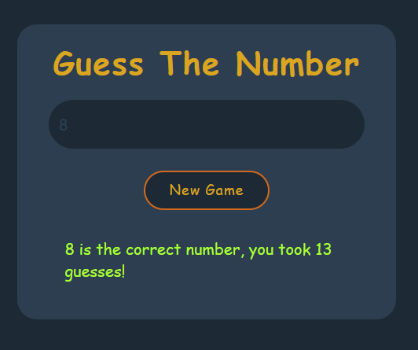

# Number Guessing Game

Welcome to the Number Guessing Game repository! This project was developed as a contribution to GSSoC 2023. The game is built using HTML, CSS, and JavaScript, providing a fun and interactive experience for players.

## Game Features

- **User-Friendly Interface**: The game has a simple and intuitive interface, making it easy for players to understand and play.
- **Random Number Generation**: A random number between 1 to 10 range is generated for the player to guess.
- **Guessing Mechanism**: Players can enter their guess in an input field and click a button to check if their guess is correct or not.
- **Winning Celebration**: When the player guesses the correct number, a winning message is displayed along with their number of guesses.
- **Play Again Option**: After winning or losing, players can choose to play the game again by clicking a "New Start" button.

## Demo

You can check out a live demo of the Number Guessing Game [here](./index.html)

### Images 

## Contact

If you have any questions or suggestions regarding the Number Guessing Game, feel free to reach out to me through the following channels:

- Twitter: [@Alkaison](https://twitter.com/Alkaison)
- GitHub: [Alkaison](https://github.com/Alkaison)

I would be happy to assist you and discuss any ideas you may have!
