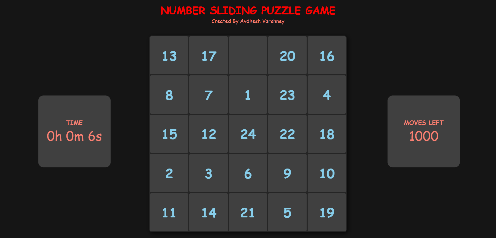

# **NUMBER SLIDING GAME** 

---

 

## **Description 📃** 
- This project is built on a basic web tech stacks such as HTML, CSS and Javascript.
- This is a single-player game.

 

## **functionalities 🎮** 
- Set the size of the board according to yourself.
- Start the game and try to solve it.
- Arrange all the numbers in the non-decreasing order.
- The player has to complete the game within the bounded number of moves.
- Player can also check how much time, player takes to solve the game.
- If unable to solve, loose the game.
- Otherwise wins the game.

 

## ** Additional Features **
- Implementing a graphical user interface (GUI) for a more interactive experience.
- Adding a background music so that user will not bored from the game as this game is for minded person.

 

## **Screenshots 📸**

 

 

## **Working video 📹**
<!-- add your working video over here -->
https://github.com/kunjgit/GameZone/assets/114330097/39f928c6-fd8d-4250-bae1-69c5a9a2fa25

 

## **Creator 👦**
[Avdhesh Varshney](https://github.com/Avdhesh-Varshney)

 

