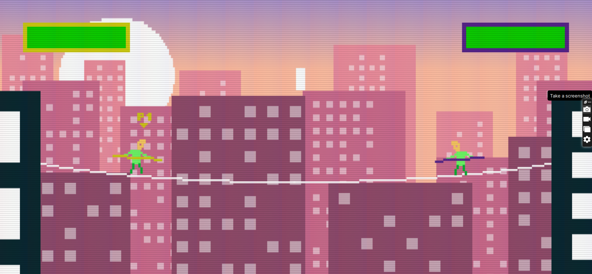

# **Game_Name**

## Off the line

 

## **Description 📃**

<!-- add your game description here  -->

"Off the Line" is an exciting offline fighting game that combines speed, precision, and skill. It offers a thrilling experience where players take control of powerful characters and compete in a variety of levels. The goal is to kill your enemy as quickly as possible.

## **How to play? 🕹️**

<!-- add the steps how to play games -->

-Player use 4 arrow keys on the keyboard to move the character- 1.UP 2.DOWN 3.RIGHT 4.LEFT

- X -> to fight with hands
- Z -> to fight with legs
- your health should not be finish otherwise game will over

-

 

## **Screenshots 📸**

 
<!-- add your screenshots like this -->

 
