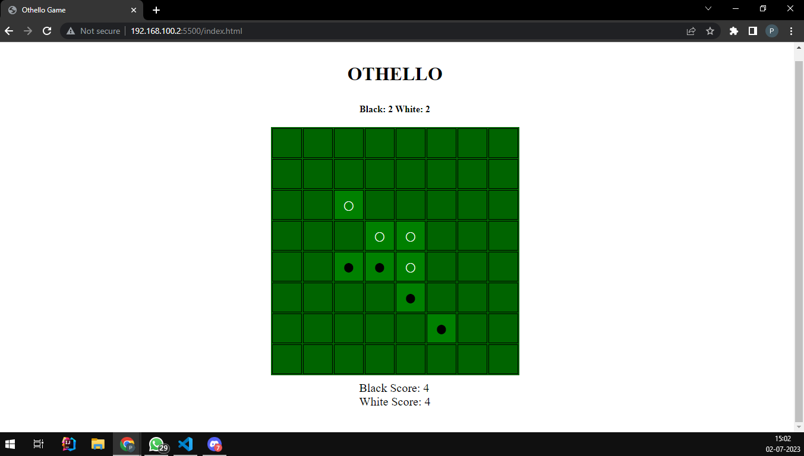

## OTHELLO

## DESCRIPTION
Othello is a classic two-player strategy board game played on an 8x8 square board. This enhancement request aims to provide a clearer understanding of the game rules and objective.
The objective of Othello is to have the most disks of your color on the board when the game ends. The game concludes when no more legal moves can be made or when the entire board is filled with disks. The player with the majority of disks on the board at the end of the game is declared the winner.

## FUNCTIONALITIES:
Players take turns placing one disk of their color on the board. A disk can only be placed on a valid empty square that, when placed, will create a line (horizontal, vertical, or diagonal) of the opponent's disks between the newly placed disk and the player's previously placed disks. When such a line is created, all the opponent's disks in that line are flipped to the player's color. If a player has a valid move available, they must make a move; otherwise, they must pass their turn.

## HOW TO PLAY
The game uses double-sided disks with one side black and the other side white. When a player places a disk and flips their opponent's disks, the flipped disks change color to match the player's color. Once the game ends, the final score is determined by counting the number of disks of each color on the board. The player with the highest score, indicating the most disks of their color, wins the game.

## SCREENSHOT

