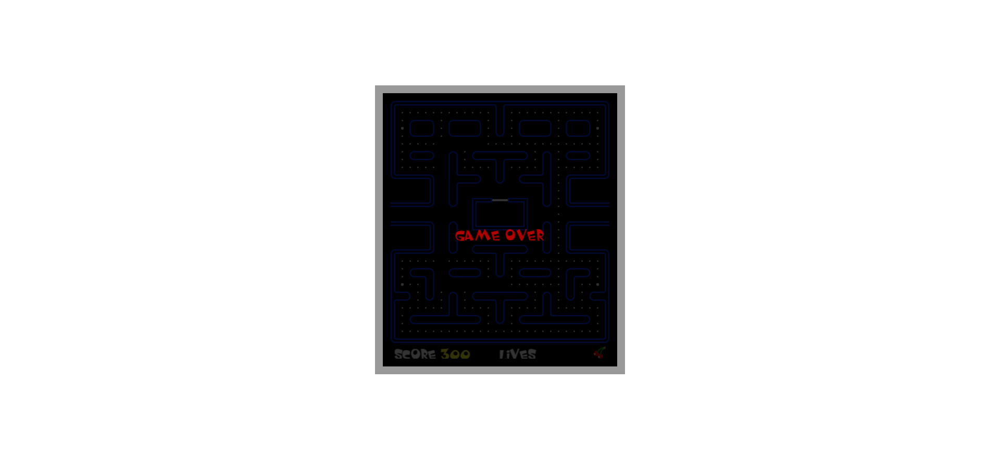
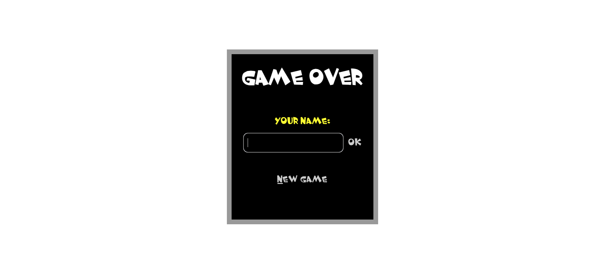

# Pac-Man Game

## Description 📃

Pac-Man is a classic arcade game where players control a character named Pac-Man to navigate through a maze filled with dots and avoid ghost enemies. The objective is to eat all the dots in the maze while avoiding the ghosts. Power pellets are available to temporarily turn the tables, allowing Pac-Man to eat the ghosts. The game ends when all the dots are eaten, or when a ghost captures Pac-Man.

This is a JavaScript implementation of the Pac-Man game with the following features:

- Classic gameplay inspired by the original Pac-Man arcade game.
- Use arrow keys or touch gestures to control Pac-Man's movement.
- Engaging maze layout with dots and power pellets.
- Colorful graphics and visually appealing game elements.
- Dynamic ghost AI that presents challenges and strategies.
- Score tracking to keep a record of the player's progress.
- Audio effects and background music for an immersive experience.

## Functionalities 🎮

- Pac-Man movement: Use arrow keys (up, down, left, right) or swipe gestures to control Pac-Man's movement through the maze.
- Eating dots: Guide Pac-Man to eat all the dots in the maze to advance to the next level.
- Power pellets: Consume power pellets to temporarily turn the tables and allow Pac-Man to eat the ghosts.
- Ghost avoidance: Avoid the ghosts moving in the maze, as they will try to capture Pac-Man. If Pac-Man is caught, a life is lost.
- Level progression: Each level increases the difficulty, with faster ghosts and more challenging maze layouts.
- Score tracking: Keep track of the score as Pac-Man eats dots and power pellets. Aim for a high score!
- Game over: The game ends when all the dots are eaten, or when Pac-Man loses all lives.

## How to Play? 🕹️

1. Use the arrow keys or swipe gestures to control Pac-Man's movement.
2. Guide Pac-Man to eat all the dots in the maze while avoiding the ghosts.
3. Consume power pellets to temporarily turn the tables and eat the ghosts.
4. Advance to higher levels by eating all the dots in each level.
5. Aim for a high score by eating as many dots as possible and avoiding ghost encounters.

## Screenshots 📸

## Working Video 📹

[]

