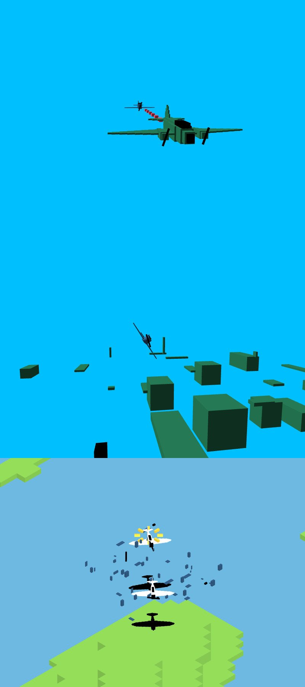

# **Pacific_Air_Battle** 

---

 

## **Description 📃**
- In this game, you will take control of a fighter jet and engage in aerial combat against enemy jets.
- You will need to use your skills and experience to dodge enemy fire and take down your targets. 
- The game features a variety of different jets to choose from, each with its own unique weapons and abilities. 
- You will also need to upgrade your jet to improve its performance.

## **functionalities 🎮**

- **A variety of different jets to choose from:** Each jet has its own unique weapons and abilities.
- **Upgradable jets:** You can upgrade your jet to improve its performance.
- **A variety of different maps to play on:** Each map offers a unique challenge.
- **A variety of different game modes:** The game features a variety of different game modes, including deathmatch, team deathmatch, and capture the flag.

 

## **How to play? 🕹️**
- The CPU will give a jet to you to fly.
- Take off from the runway.
- Find and engage enemy jets.
- Use your weapons to shoot down the enemy jets.
- Be careful not to get shot down yourself.
- Repeat steps 3-5 until all of the enemy jets are destroyed.

 

## **Screenshots 📸**
 

