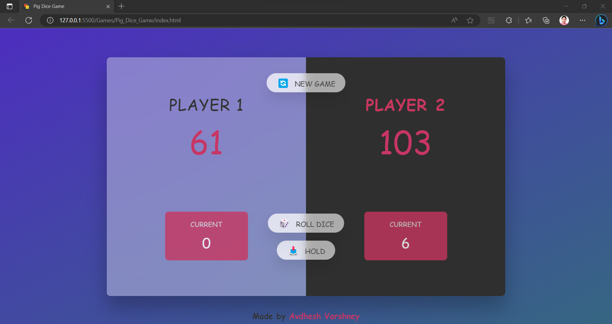

# **Pig Dice Game**

---

 

## **Description 📃** 
- This project is built on a basic web tech stacks such as HTML, CSS and Javascript.
- This game is just for fun.

## **functionalities 🎮** 
- Two players take turns rolling a single die.
- Rolling a 1 results in losing all accumulated points for the current turn.
- Accumulated points are added to the player's total score when they choose to hold.
- The first player to reach a 100 winning score wins the game.

## ** Additional Features **
- Displaying the current scores of each player.
- Implementing a graphical user interface (GUI) for a more interactive experience.
- Adding sounds for the dice rolling and when game over.

 

## **How to play? 🕹️**
- To roll the die, click a "Roll" button or press a key.
- The die will generate a random number between 1 and 6.
- If you roll a number other than 1, the value is added to your current score for the turn.
- You can choose to roll again to accumulate more points, or you can decide to end your turn and "Hold" your current score.
- If you roll a 1, your turn ends immediately, and you lose all the points accumulated during that turn. It becomes the next player's turn.
- When you choose to "Hold," the points accumulated during your turn are added to your total score.
- Your turn ends, and it becomes the next player's turn.
- Continue taking turns until one of the players reaches or exceeds a 100 winning score.
- The player who reaches the winning score first is declared the winner.

 

## **Screenshots 📸**

 

 

## **Working video 📹**
<!-- add your working video over here -->
https://drive.google.com/file/d/18MmtWH8ZjxDMTLFhgkrBA-oT1QBZ4JtV/view?usp=sharing
