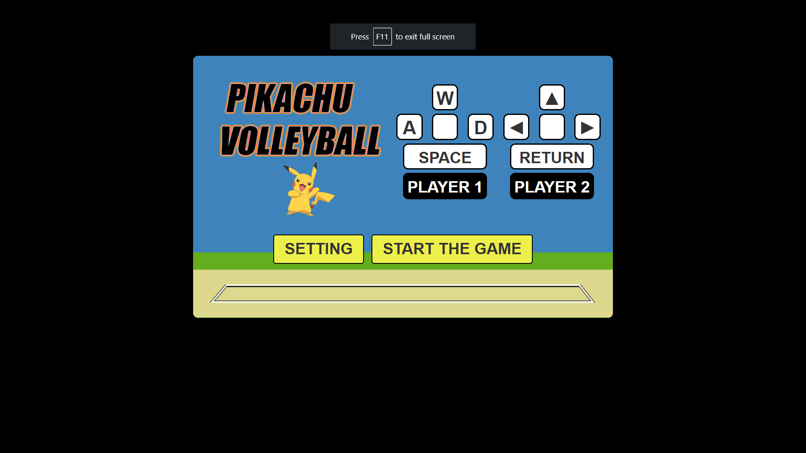

# **Game_Name** 
Basketball

 

## **Description 📃**
- It is a game made with HTML, bootstrap-css and JavaScript. It is a 2 player game. It follows the rules of volleyball.
 

## **functionalities 🎮**
- Player can jump and smash the ball to the opposite court.
- If the ball falls onto the ground, the opposite team player wins a point.
 

## **How to play? 🕹️**
- All the controls are shown on the home page.
- The first to 21 points wins.

 

## **Screenshots 📸**

 

 