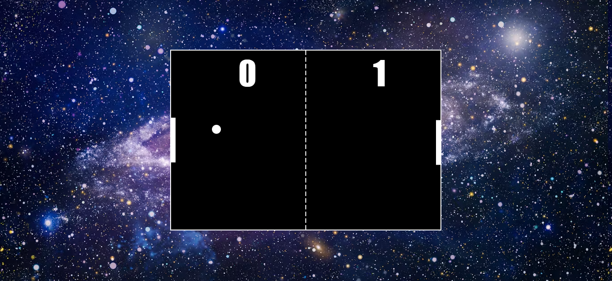

# **Ping_Pong** 

---

 

## **Description 📃**
- Ping pong, also known as table tennis, is a sport in which two or four players hit a lightweight ball back and forth across a table using small solid rackets. This game will be played between  
- The player must prevent the ball from touching the surface of the table on their side.

 

## **How to play? 🕹️**
- Controls:
    - use mouse pointer to control the paddle.
- Players must allow a ball played towards them to bounce once on their side of the table and must return it so that it bounces on the opposite side. 
- A point is scored when a player fails to return the ball within the rules. 
- This is a endless game, so the player can play as much as they want

 

## **Screenshots 📸**

 

 