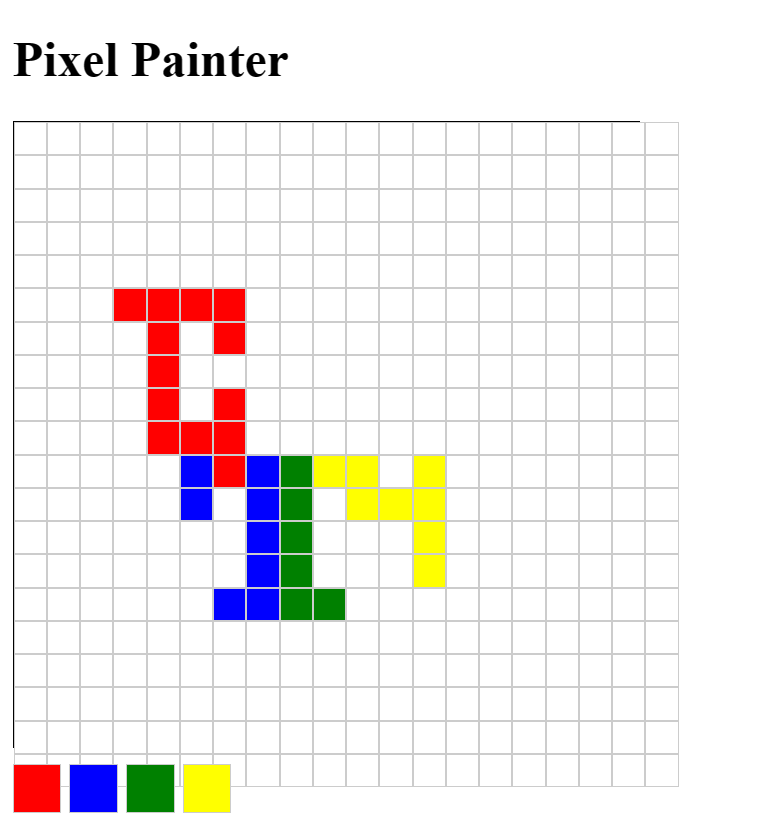

# Pixel Painter

Pixel Painter is a JavaScript-based game that allows players to create pixel art on a virtual canvas. It provides a simple and intuitive interface for painting pixels with various colors, unleashing your creativity and artistic skills.

## Gameplay

- Upon starting the game, you will be presented with a blank canvas grid.
- Select colors from the color palette at the bottom of the screen by clicking on the color squares.
- Click on any pixel in the canvas grid to paint it with the selected color.
- Use different colors to create your desired pixel art composition.
- You can zoom in or out of the canvas for precise pixel placement.
- Continue painting pixels until you have completed your pixel art creation.

## Features

- Interactive canvas grid for pixel art creation.
- Limited color palette to choose from.
- Zoom functionality for precise pixel placement.
- Easy-to-use interface with a click-based painting mechanic.

## ScreenShots

*Pixel Painter Gameplay*

*Pixel Painter Color Palette*

