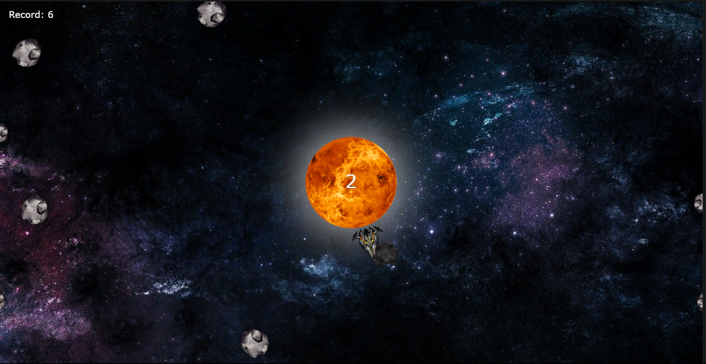

# **Planet Savior** 

---

 

## **Description 📃**
<!-- add your game description here  -->
- The game revolves around protecting a planet from incoming asteroids. The player can click on the canvas to start playing and control the movement of a player-controlled spaceship. By moving the spaceship and clicking on the canvas, the player can shoot bullets to destroy the asteroids. The objective is to survive as long as possible, avoiding collisions with the asteroids, and destroying as many asteroids as you can.

## **Functionalities 🎮**
<!-- add functionalities over here -->
- **Player-Controlled Spaceship**: The player controls a spaceship that is represented by a rotating image. The spaceship's orientation changes based on the mouse's position relative to the center of the canvas. The spaceship is used to shoot bullets at the incoming asteroids.
- **Shooting Mechanism**: When the player clicks on the canvas, the spaceship fires bullets in the direction of the click. The bullets move upward from the spaceship, trying to hit and destroy the incoming asteroids.
- **Asteroids**: Asteroids are represented by rotating images and move towards the planet in different directions. The player must destroy the asteroids by shooting them with bullets. Each destroyed asteroid increases the player's score.
- **Explosions**: When an asteroid is hit and destroyed, an explosion effect is shown at the asteroid's location. The explosion animation adds visual feedback to the player's successful shots.
- **Game Over**: If an asteroid collides with the planet or the player's spaceship, the game ends, and the player is presented with the "Game Over" screen. The player's score is displayed, and the best score achieved in previous attempts is also shown as a record.
- **Responsive Design:**: The game is designed to be responsive and can be played on different screen sizes, including full-page view.

## **How to play? 🕹️**
<!-- add the steps how to play games -->
- Start the Game
- Control the Spaceship
- Shoot Bullets
- Destroy Asteroids
- Avoid Collisions
- Survive and Score
- Enjoy

 

## **Screenshots 📸**

 
<!-- add your screenshots like this -->
<!--  -->

 