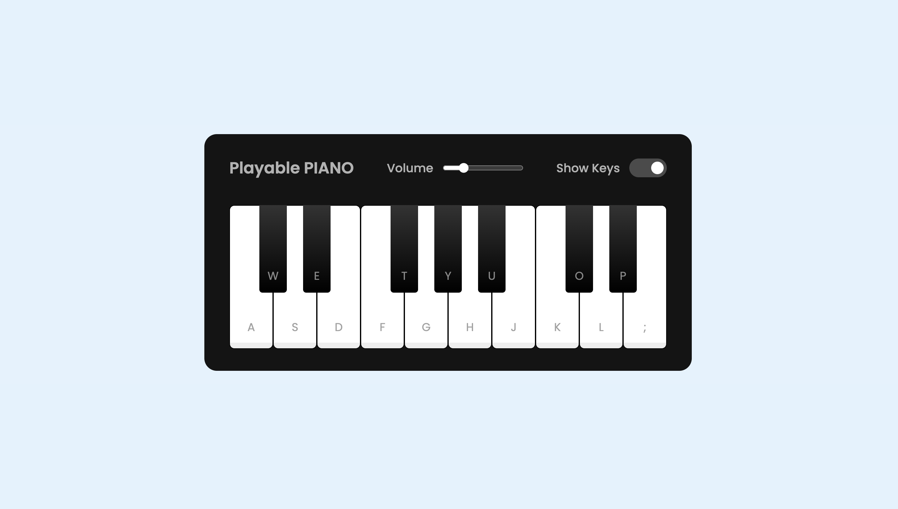

# **Playable_Piano** 

---

 

## **Description 📃**

Recursive Arts Virtual Piano simulator is the ultimate online piano app that everyone can play. Enjoy the beautiful sound of a world-class Grand Piano. On desktop/laptop computers, you can play notes using your keyboard or mouse. The tech stack being used is HTML,CSS,Js and also included keyboard tunes.

- 

## **functionalities 🎮**

* Can press any note randomly and plays sound in the background
* Fully responsive design
* Has an option to show notes or hide them while playing piano
- 
 

## **How to play? 🕹️**

-
Virtual Piano enables you to play the piano on your computer keyboard.
* It helps to dive into soothing music.

Happy Playing :)

 

## **Screenshots 📸**

 

 

## **Working video 📹**
<!-- add your working video over here -->
