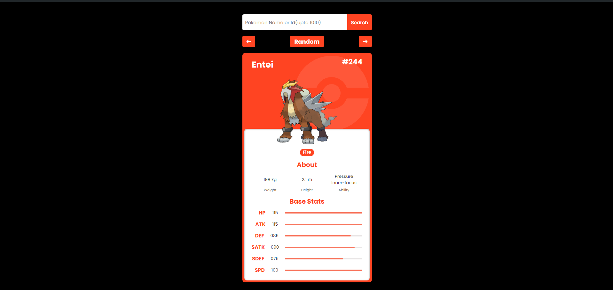

# **Pokemon_Stats_Card** 

---

 

## **Description 📃**
This allows the user to get the Pokemon details by entering the name of the pokemon or the id into the searchbox.
- 

## **functionalities 🎮**
<ol>
<li>The user can enter the name of the pokemon or the id of the pokemon and press enter or the search icon to get results</li>
<li>There are right and left arrow buttons to see the pokemon before or after the present displayed pokemon</li>
<li>There is also a random pokemon button which displays the result of pokemon from id 1 to 1025 at random</li>
<ol>

 

## **How to play? 🕹️**
Type the name of the pokemon or the id (1-1025) and press the search button
- 

 

## **Screenshots 📸**

 

 

