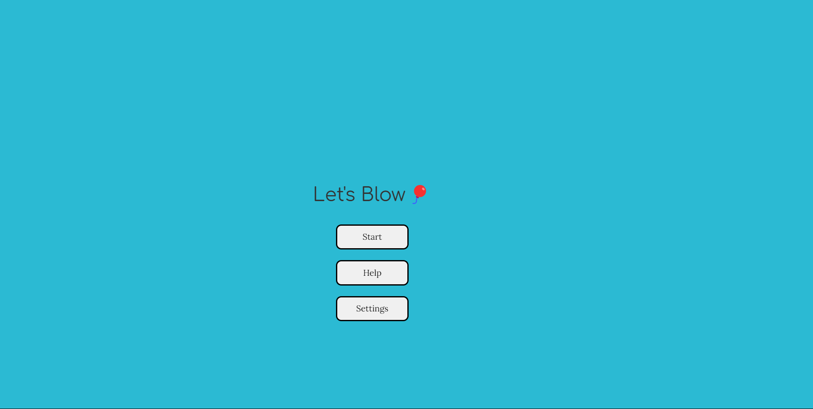

# **POP_MY_BALLOON** 

---

 

## **Description 📃**
- The basic premise of the game remains the same, regardless of the difficulty level or the input method. There will be a range of numbers from which players can choose a number. If the manage to guess the randomly chosen number, the balloon will pop and they lose. If they manage to avoid the lucky number, the range decreases such that their guess either becomes the new lower bound or new upper bound, and the balloon inflates just a little bit more.

## **functionalities 🎮**
- We have two levels:

Easy Level: The range starts off as 0-100 and players can guess any number within the range.
Harder Level: The range starts off as 0-84, and players can only guess numbers that are either from the lower bound (LB) to LB+12 or from the upper bound (UB) to UB-12.

-We also have two different modes:

Text Mode: Players type their guesses manually into the guess box.
Speech Mode: Players can say their guesses and the game will try to recognize and process what they guess.

 

## **How to play? 🕹️**

- Player 1 has to guess any number and that has to avoid the lucky number.
- Player 2 has to do the same as Player 1.
- The goal is to complete the game without guessing the lucky number.
- Each time you guess correct the balloon blows up.
- Keep playing and try to not to guess the lucky number in order to win the game. 
 

## **Screenshots 📸**

 

 

