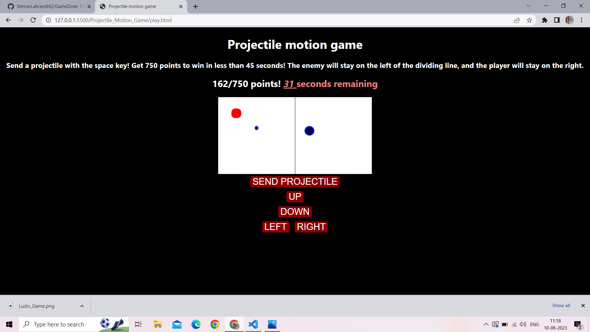

The rules are simple.
You have 45 seconds to get 750 points. 
Use the WASD or arrow keys to navigate, and use the space bar to send your projectile. 
You can only send one projectile at a time. You earn around 35 points per hit. 
The enemy will stay on the left of the dividing line, and the player will stay on the right.
Send a projectile with the space key! Get 750 points to win in less than 45 seconds! 
# _Game_Name_

---
Proectile Motion Game

 

## _Description 📃_

- The rules are simple.
- You have 45 seconds to get 750 points. 
- Use the WASD or arrow keys to navigate, and use the space bar to send your projectile. 
- You can only send one projectile at a time. You earn around 35 points per hit. 
- The enemy will stay on the left of the dividing line, and the player will stay on the right.
- Send a projectile with the space key! Get 750 points to win in less than 45 seconds! 

 

## _How to play? 🕹️_
 
Try to beat the enemy with prjectile , you can use left,right,top,bottom buttons.
 

## _Screenshots 📸_

 

 
