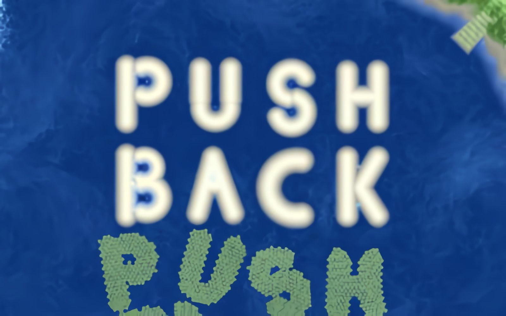

# **Pushback** 

---

 

## **Description 📃**
- In Pushback you create currents to help the stranded boats get back to the mainland. 
- This game uses fluid dynamics to simulate the water.n.

## **How to play? 🕹️**
- Controls:
	- Click and drag to create currents on water
	- Pause - P
	- Restart - R

	
 

## **Screenshots 📸**

 

 
