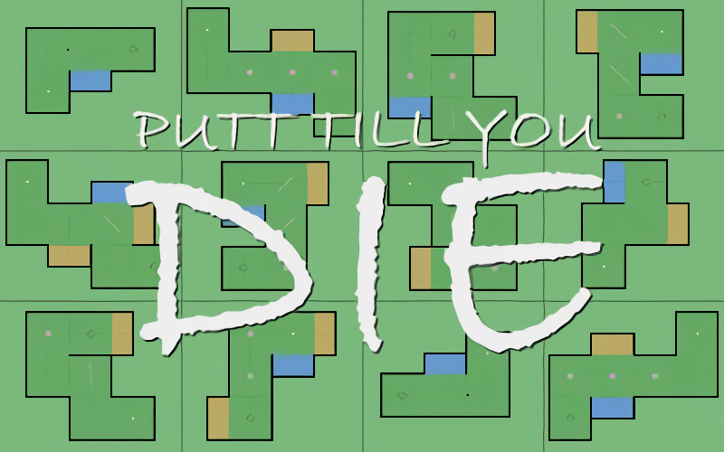

# **Putt_Till_You_Die** 

---

 

## **Description 📃**
- Putt Till You Die is a 2 dimensional bird's eye view mini-putt golf game written in JavaScript, HTML, and CSS.
- The aim of Putt Till You Die is to basically putt the ball into the goal. That's pretty much it.
- Putt Till You Die is best enjoyed in fullscreen and with some chillout music playing in the background.
- Note that when you close the Putt Till You Die application, the game state will be persisted to the browsers local storage, so the next time you start Putt Till You Die, the game will continue exactly in the same state.

## **How to play? 🕹️**
- Instructions:
	- Rest from battle to regain your health and stamina. Health and stamina are represented onscreen by the red and blue bars, respectively.
	- Use your spartan charge and ground pound attacks to stun your enemies and gain the upper hand.
- Controls:
	- Hold and move the left mouse button to aim, a longer line means more putt power.
	- Press space key to cancel aiming.
	- Release the left mouse button to make your putt.
	- Hold the shift key to show your statistics.
	- Press the TILDE key to show the instructions.
	- Press the BACKSPACE key to access the reset menu.

 

## **Screenshots 📸**

 

 
