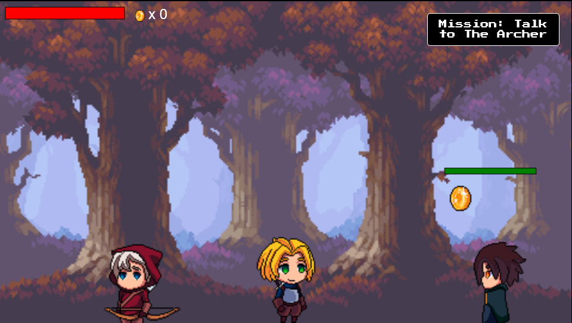

# **Quest for Riches**

---

## **Description 📃**

Quest for Riches is a side-scrolling action-adventure game where players navigate through a fantasy world, battling enemies and solving puzzles to find hidden treasure. The game includes a health system, enemy AI, player combat mechanics, and level progression. The game is designed to be engaging and fun, with increasing difficulty as the player advances through the levels.

## **Functionalities 🎮**

- Two levels
- Player controls for moving left, right, jumping, and attacking
- Simple enemy AI with predictable movement patterns
- Puzzles such as finding keys and matching code patterns
- Scoring system based on treasures collected and level completion time
- Simple design for desktop browsers

## **How to play? 🕹️**

1. Use the **A** and **D** keys to move the player character left and right.
2. Use the **Spacebar** to jump.
3. Use **E** to interact.
4. **Left Mouse Click** to attack.
5. Navigate through the levels by speaking to NPCs and following missions.
6. Collect coins to increase your score.
7. Solve the code pattern to open the treasure.
8. Try to complete all levels with the highest score possible.

## **Screenshots 📸**

---
