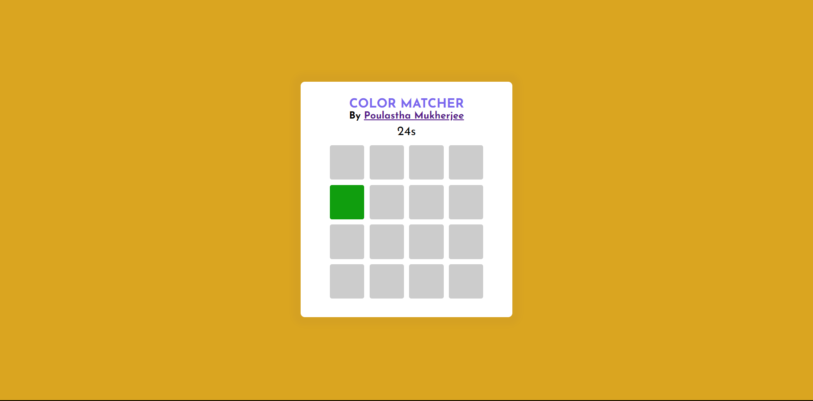
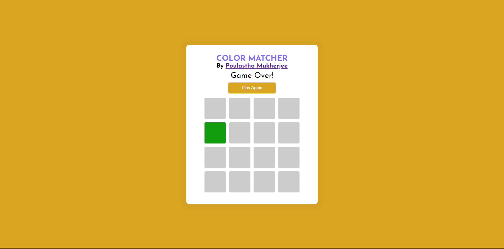
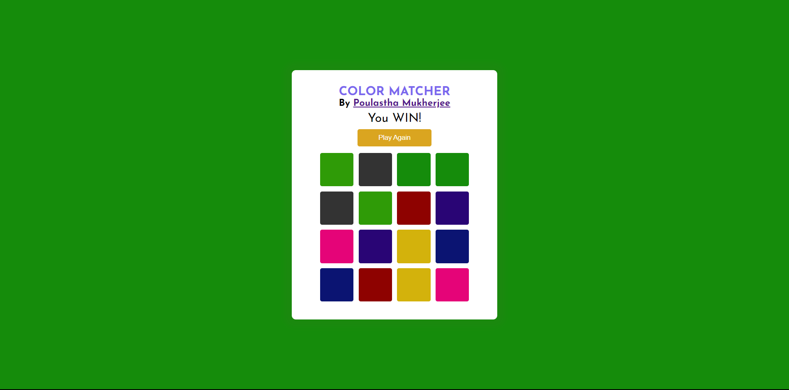

# **Color Matcher**

 

## **Description 📃** 

- Color Matcher is a single-player game application coded in HTML, CSS and JavaScript.
- You can play it using only your Left Mouse Button!

## **Functionalities 🎮** 

- The application is a simple Matching type game that can be played by a single-player.
- The player can play the game using the Mouse, you only just need to use the Left Mouse Button to play the game.
- The gameplay is very simple. All you have to do is match the same colored tiles within 30 seconds.
- Each color you match will disappear and you to need to proceed to other colors.
- Try to match all the colors before the time runs out.

 

## **How to play? 🕹️**

- Download the codes.
- Copy and Paste it inside a local host folder e.g Xampp, Wampp.
- Open the web browser and enter "locahost/(folder_name)" in the URL
- Use your Left Mouse Button click on the tiles to display their color.
- Enjoy the Game!

 

## **Screenshots 📸**

 

 

## **Working video 📹**
<!-- add your working video over here -->

Coming Soon...
