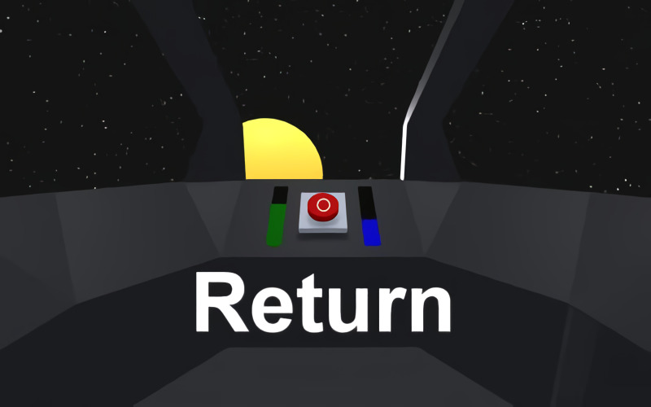

# **Return** 

---

 

## **Description 📃**
- You were one of the select few chosen to trial a new hyperspace jump drive. You reach towards the red jump button in the front of your cockpit as directed.
- There is a whooshing noise as the jump drive spins up. Space and time warps around you, suddenly there is a bang and the ship drops out of hyperspace. 
- 'This isn’t the correct destination' you think to yourself, the jump drive must be faulty.
- Return is a game about finding your way back home after being lost amongst the stars. ('Home' is the blue planet of course, a.k.a Earth).

## **How to play? 🕹️**
- The game is controlled with just a click input, look around to move the cursor and tap or click to press objects in the ship's cockpit.
- Tested on Desktop, Mobile (magic window and Cardboard).
- Game may take more than 1 minute to load because the textures are compressed and embedded within the script
- Good luck, hopefully you will find your way back!
	
 

## **Screenshots 📸**

 

 
