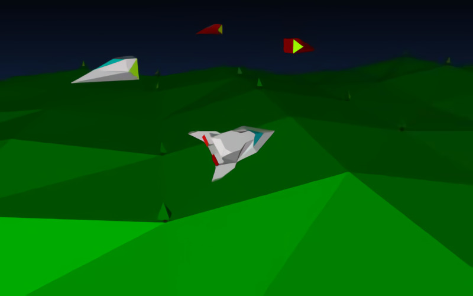

# **Return_To_Planet_Figadore** 

---

 

## **Description 📃**
- It's 50 years since humans first went to the moon. Now that we are planning to go back, the Reguliths need to escape before we find them. 
- They have light-jumped to planet Figadore in the Hercules cluster to flee. Fred has been kidnapped by the aliens who want to take over the planet. 
- Play as his sister Jade and race to get the planet back and prevent the Regulith spreading a deadly infection.

## **How to play? 🕹️**
- Controls:
	- Use cursor keys/WASD/gamepad to fly.
	- Q/E lateral adjustments. 
	- PageUp/PageDown to throttle. 
	- Compass at the top.
	- Slow to about 60 knots, then make your landing approach. Good luck
	
 

## **Screenshots 📸**

 

 
