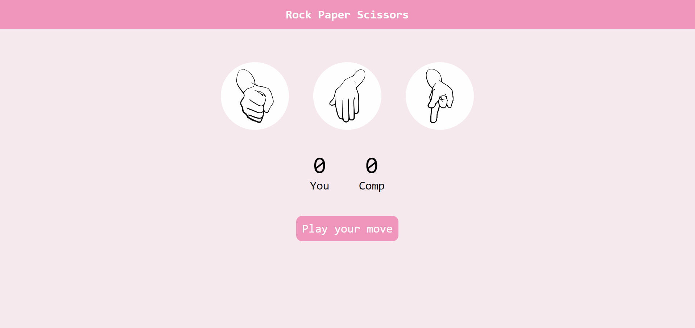

# **ROCK_PAPER_SCISSOR** 

---

 

## **Description 📃**
- This game is based on the classic game of rock paper and scissors.

## **functionalities 🎮**
-   The user chooses one from the three options available: Rock, Paper, or Scissors.
-   The computer simultaneously makes a random choice from the same options.
-   The combinations of choices determine the outcome: either the user wins, the computer wins, or it's a tie.
 

## **How to play? 🕹️**
- In this,the user chooses one from the three options available and the computer does the same simultaneously. And thus, making the combinations, one of the both wins or either its a tie
Note:
1. Rock defeats Scissor
2. Scissor defeats Paper
3. Paper defeats Rock

 

## **Screenshots 📸**

 

 
