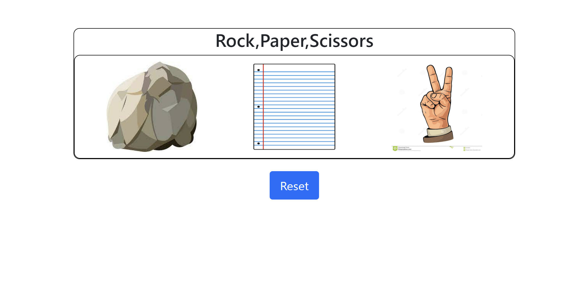

# **Game_Name** 
Rock Paper Scissor

 

## **Description 📃**
This Rock Paper Scissors game is a web-based game created using HTML, CSS, and JavaScript. It allows the user to play against the computer in the classic game of Rock Paper Scissors.

## **functionalities 🎮**
<!-- add functionalities over here -->
- User vs Computer: Challenge yourself against the computer in an exciting game of Rock Paper Scissors. Test your strategy and luck as you try to outsmart the computer's choices.
- Clean and Responsive Design: The game features a clean and user-friendly interface created with HTML and CSS. The design is responsive, ensuring a seamless experience across different devices and screen sizes.
- Interactive Gameplay: Using JavaScript, the game allows the user to select their choice from Rock, Paper, or Scissors. The computer randomly generates its own choice, and the game updates the interface to display both choices.
- Real-time Results: After both the user and computer have made their choices, the game determines the winner based on the traditional Rock Paper Scissors rules. The outcome of each round, whether it's a win, loss, or a tie, is instantly displayed on the screen.
- Simple and Engaging: This game offers a straightforward and engaging experience. It's easy to understand and play, making it suitable for users of all ages. Challenge yourself or pass the time with this classic game.
 

## **How to play? 🕹️**
- The player needs to select his choice from rock paper and scissor.
- Then the computer will play its move.
- And then the result will be declared based on traditioal rock paper scissor rules.

 

## **Screenshots 📸**

 

