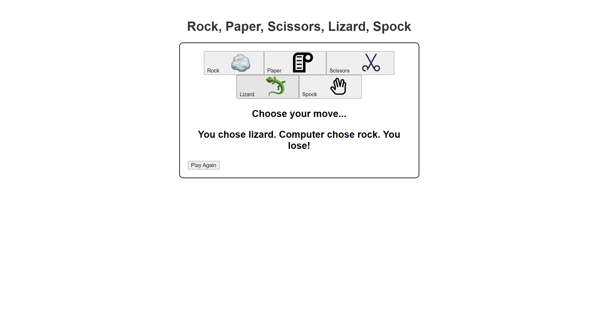

# **Rock_Paper_Scissors_Lizard_Spock* 

---

 

## **Description 📃**
<!-- add your game description here  -->
- "Rock Paper Scissors Lizard Spock" is a fun and popular hand game that adds more complexity to the traditional "Rock Paper Scissors" game. 

- In this version, players can choose from five different options: Rock, Paper, Scissors, Lizard, or Spock. 

- The game follows specific rules to determine the winner based on the chosen moves.

## **functionalities 🎮**
<!-- add functionalities over here -->
- Rock crushes Scissors and crushes Lizard.
- Paper covers Rock and disproves Spock.
- Scissors cut Paper and decapitate Lizard.
- Lizard eats Paper and poisons Spock.
- Spock smashes Scissors and vaporizes Rock.
 

## **How to play? 🕹️**
<!-- add the steps how to play games -->
- Open the web application or website for "Rock Paper Scissors Lizard Spock."
- Click on one of the buttons to select your move (Rock, Paper, Scissors, Lizard, or Spock).
- The computer will randomly select its move.
- The game will display the results, indicating whether you win, lose, or it's a tie.
- If you want to play again, click the "Play Again" button.

 

## **Screenshots 📸**

 
<!-- add your screenshots like this -->
<!--  -->

 
