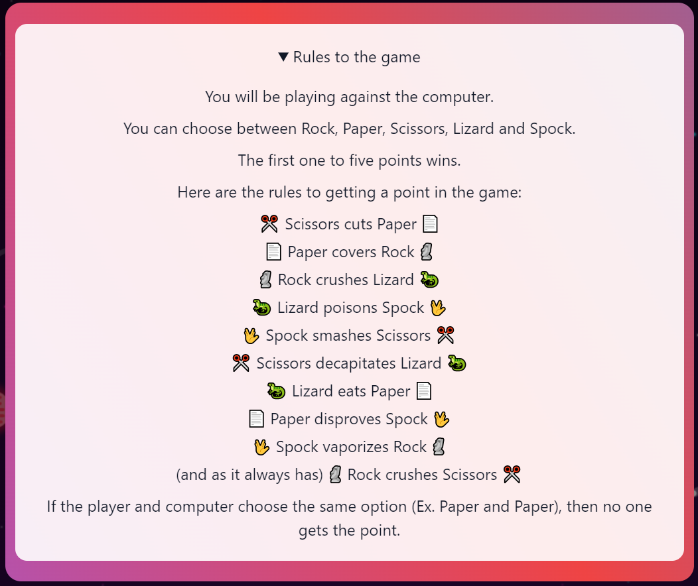
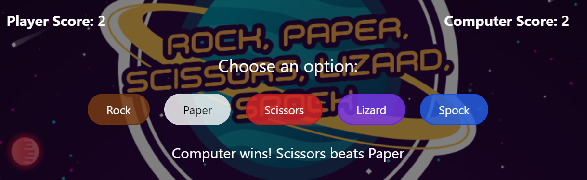
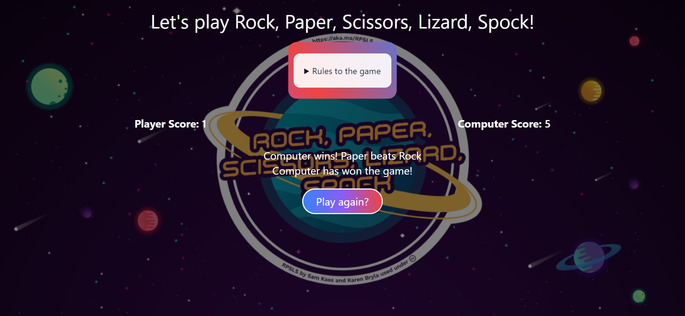

# **Rock Paper Scissors Lizard Spock Game**

---

 

## **Description 📃**
Rock, Paper, Scissors, Lizard, Spock is a game of chance that expands the traditional game of Rock, Paper, Scissors and was invented by Sam Kass and Karen Bryla. It was brought to fame after being used to settle a dispute about what to watch on TV between Sheldon and Raj in episode "The Lizard-Spock Expansion" in the famous show "The Big Bang Theory".
-
 

## **functionalities 🎮**
1. Player vs. Computer gameplay
2. Five choices: Rock, Paper, Scissors, Lizard, Spock
3. Random computer move generation
4. Score tracking for both player and computer
5. Game reset option after completion
6. Responsive UI with animated buttons
7. Rules explanation available on demand
- 
 

## **How to play? 🕹️**
Simply click on the option which you'll like to choose, the computer will make a random move and the winner will be declared. Whoever reaches 5 points first, WINS!!

# Rules 📝
1. Scissors cuts Paper
2. Paper covers Rock
3. Rock crushes Lizard
4. Lizard poisons Spock
5. Spock smashes Scissors
6. Scissors decapitates Lizard
7. Lizard eats Paper
8. Paper disproves Spock
9. Spock vaporizes Rock
10. (and as it always has) Rock crushes Scissors

- 

 

## **Screenshots 📸**

 

 

## **Working video 📹**

[Watch Video](./path/to/your/video.mp4)