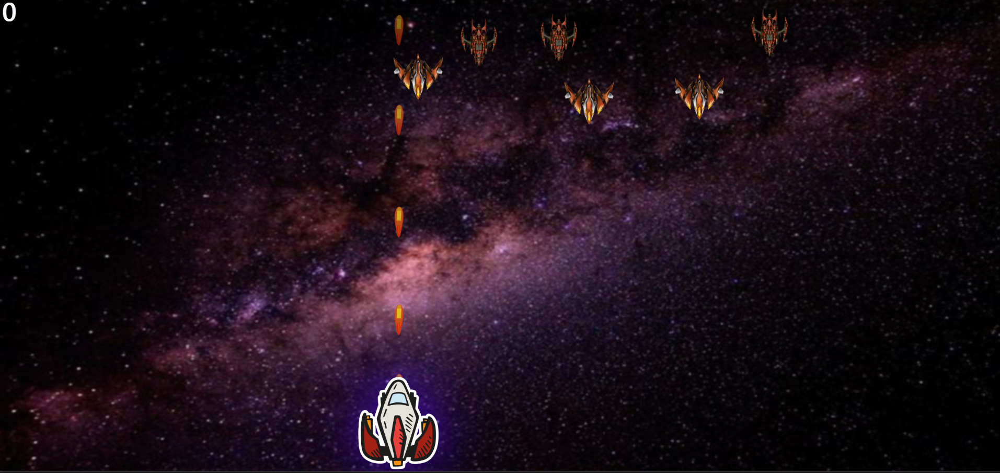

# **Rocket_Shooter** 

---

 

## **Description 📃** 
- Rocket Shooter is a game where player needs to shoot all the enemy rockets hovering in the space. 

## **functionalities 🎮** 
- Player can move in horizontal directions.
- Player can shoot using bullets.
- There will be a score for each shoot.
 

## **How to play? 🕹️**

- Start the game by clicking on the "Play Now" button.
- Enemy rocket will randomly appear on the screen.
- Use your Left-Arrow or Right-Arrow keys to move.
- Each successful hit on a enemy rocket will earn you points.
- Aim to achieve the highest score.
- The game ends when you defeat all the enemyes.
- Your final score will be displayed on the screen at the end.
 

## **Screenshots 📸**
 

 

Made with ❤️ by [Anurag Vishwakarma](https://vishanurag.github.io/)