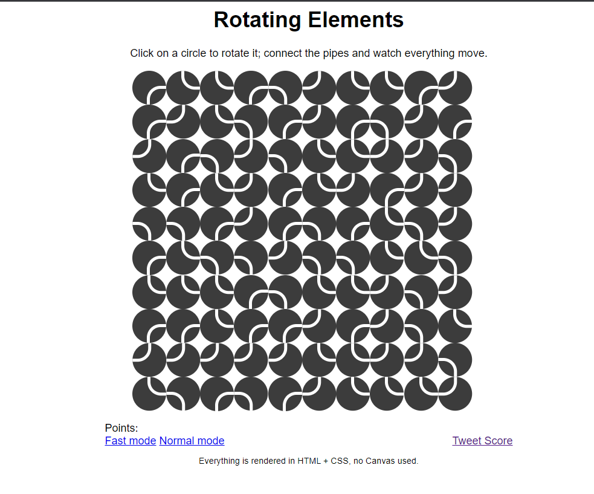

# Rotating Elements
* The game logic is quite simple, you click on a circle which then rotates 90deg clockwise and if the white pipe get’s connected with surrounding ones, these will rotate the same way.
* If you watch these little circles, after clicking on one, you can see that they rotate continuously. These circles have four states; 0, 90, 180 or 270 degrees rotated clockwise. These states are represented by a CSS selector (in this case a attribute selector).

## **How to play? 🕹️**
1. Select the right elements will earn you multiple points.
2. Selecting Wrong elements will deduct your points. 

## Screenshots 📸

 

 