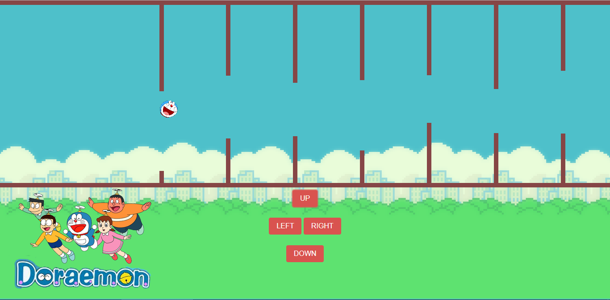

# **Game_Name** 
Save_Doraemon

 

## **Description 📃**
- It is a simple game made with HTML, bootstrap-css and JavaScript. It has a doraemon which faces a maze like structure incoming at it when the game is loaded. There are controls at the bottom of the page to move doraemon and save him from colliding into the incoming maze.

## **functionalities 🎮**
- There are four buttons:
1. UP : Moves Doraemon to Top by 1 step
2. LEFT: Moves Doraemon to Front by 1 step
3. RIGHT: Moves Doraemon Back to Prev by 1 step
3. DOWN: Moves Doraemon to Down by 1 step
 

## **How to play? 🕹️**
- Using the above functionalities The user can move Doraemon by his choice to save him from collision.

 

## **Screenshots 📸**

 

 