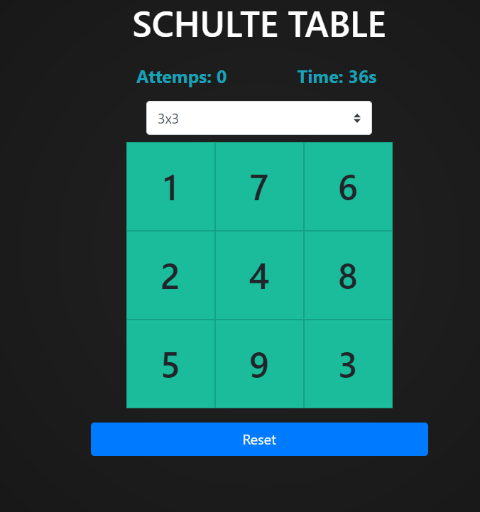

# **Schulteit Hard!** 

---

 

## **Description 📃**
- The trick though you're going to try to stay focused on the center dot that i just added to the grid

## **How to play? 🕹️**
-a 5x5 Schulte table would have 25 numbers arranged in a random order in a 5x5 grid. The goal of the exercise is to scan the table horizontally and vertically to find all the numbers in order as quickly as possible. The Schulte table is designed to improve focus, speed, and mental agility.
	
 

## **Screenshots 📸**

 

 
