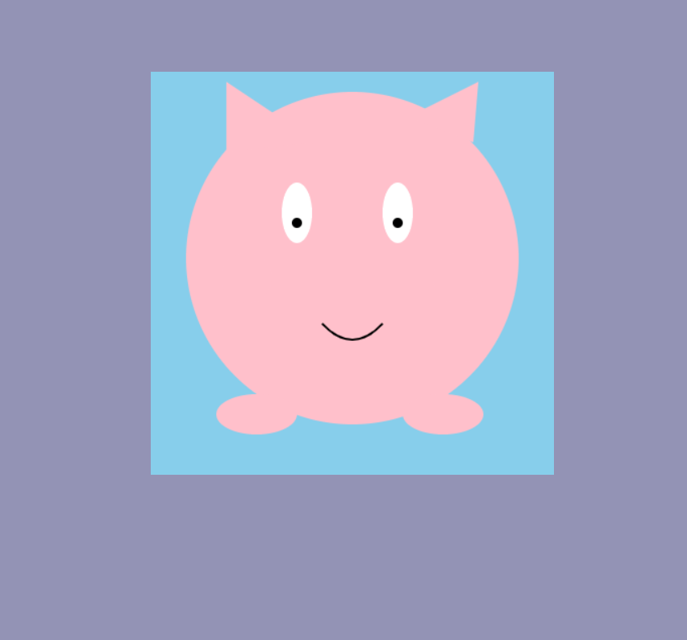
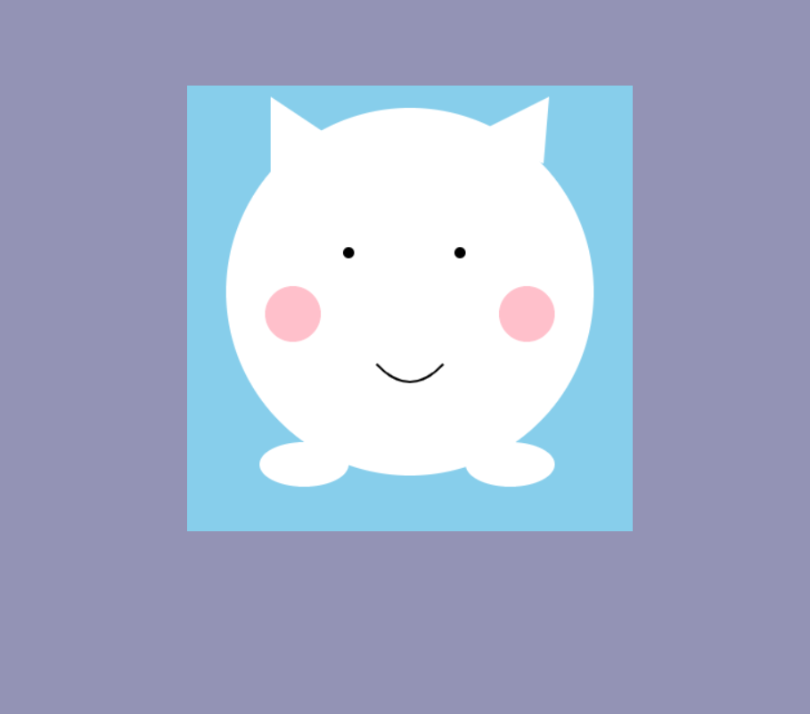
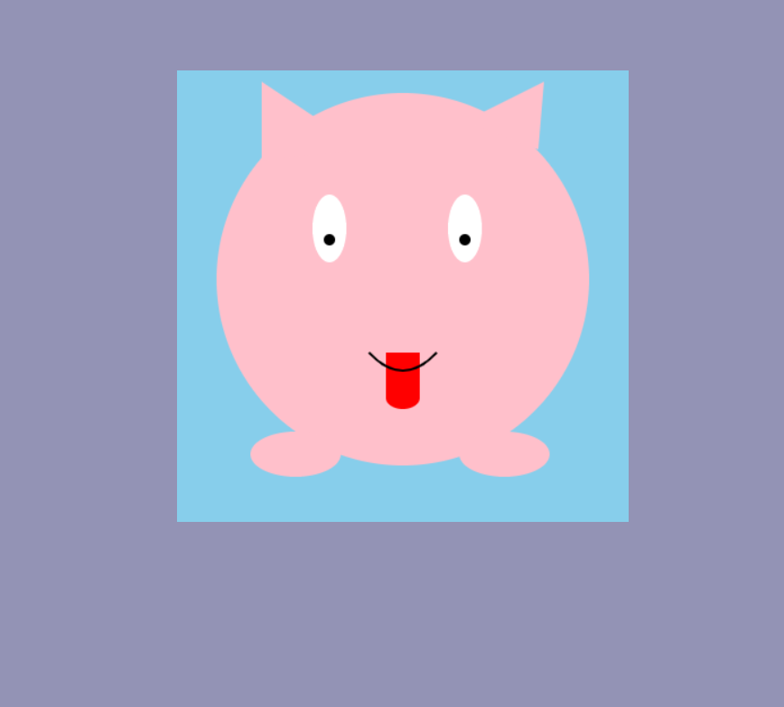

# Screen Pet Game

## Description 📃
The Screen Pet game is an interactive, event-based program where a cute pet on your screen responds to your mouse interactions. The pet can display different emotions such as happiness, cheekiness, and sadness based on how you interact with it. This game provides a delightful way to engage with a virtual pet that reacts in real-time.

## Functionalities 🎮
1. **Happy Face**: The pet blushes and looks happy when the mouse moves over it.
2. **Cheeky Face**: The pet shows its tongue and crosses its eyes when double-clicked.
3. **Sad Face**: The pet becomes sad if ignored for a period of time and will become happy again when the mouse moves over it.

## How to Play? 🕹️
1. **Move Mouse Over Pet**:
    - When you move your mouse over the pet, it will blush and look happy.
2. **Double-Click on Pet**:
    - Double-clicking on the pet will make it show a cheeky face, sticking out its tongue and crossing its eyes for a short period.
3. **Ignore the Pet**:
    - If you ignore the pet by not interacting with it, it will gradually become sad. Move the mouse over the pet again to make it happy.

## Screenshots 📸

1. **Happy Face**:
    

2. **Cheeky Face**:
    

3. **Sad Face**:
    

3. **Tongue Face**:
    

