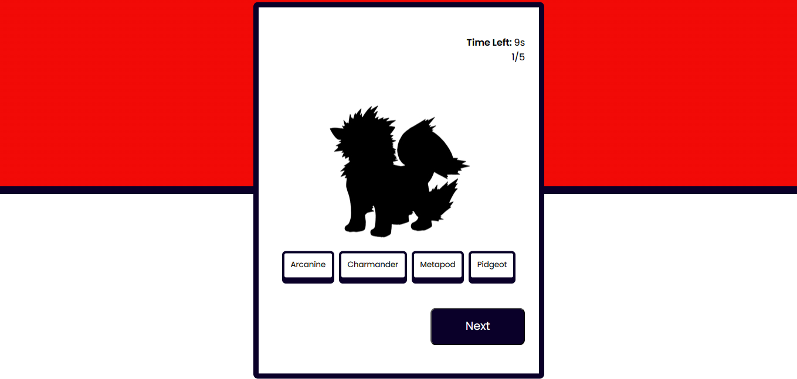

# **Game_Name** 
Shadow_PokeGuess

 

## **Description 📃**
- It is a simple game made with HTML,css and JavaScript. In this game, players are presented with a series of shadowy images representing different Pokémon species. The objective is to correctly guess the name of the Pokémon.

## **functionalities 🎮**
- There are four options given to the player.
- The player has to choose the correct name of the pokemon which is appearing in the shadow.
 

## **How to play? 🕹️**
- The player is given 10 seconds to guess the correct name of the pokemon.
- If the player answers correctly the score increases and if the player answers wrong then it moves to next question.
- If the player could not answer within 10 seconds also it moves to another question.

 

## **Screenshots 📸**

 

 