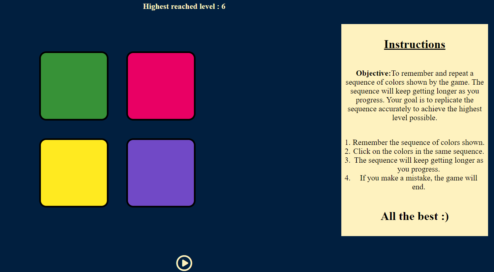

# **Simon_Game_Challenge**

---

 

## **Description 📃**

- The Simon game is a classic memory game that requires players to follow a sequence of colors and sounds to advance to higher levels. In this version built using HTML, CSS, and JavaScript, players are presented with a game board consisting of four colored buttons - green, red, yellow, and blue.

## **Functionalities 🎮**

- The game starts with a sequence of colors played by the computer, and players must repeat the sequence by clicking the corresponding buttons in the correct order. The game progressively gets more difficult with longer and more complex sequences. The game includes features such as a level counter, a highest score tracker, and a play button.
   

## **How to Play? 🕹️**

- Press the "Play" button to start the game.
- The game will randomly choose a color and play a sound. Repeat the color and sound by clicking the corresponding button.
- The game will add another color and sound to the sequence. Repeat the sequence by clicking the corresponding buttons in the correct order.
- Keep repeating the sequence correctly to advance to higher levels.
- If you click the wrong button or take too long to repeat the sequence, the game is over.
- The highest level reached during the game will be displayed on the screen.
- Press the "Play" button again to start a new game.

 

## **Screenshots 📸**

 

 

## **Working Video 📹**

<!-- add your working video over here -->

.gif>)
