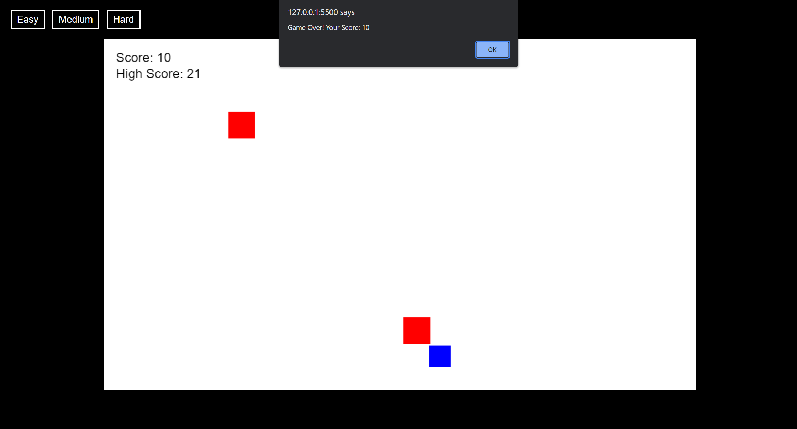

# **Sky_Dodge** 

---

 

## **Description 📃**
<!-- add your game description here  -->
- "Sky Dodge" is an exhilarating arcade-style game where you take control of a nimble flying object soaring through the sky. Your mission is to deftly navigate through the sky while avoiding the rain of falling blocks. Show off your piloting skills as you dodge and weave through the blocks to stay safe and achieve the highest score possible. Be cautious, as the challenge intensifies with each passing moment. How long can you last in the sky without a collision?

## **functionalities 🎮**
<!-- add functionalities over here -->
- Player Control: The player controls a flying object using left and right arrow keys or A and D keys to move horizontally across the screen.

- Falling Blocks: Blocks of various shapes and sizes descend from the top of the screen towards the player's flying object at random intervals.

- Dodging Mechanism: The player must navigate the flying object left or right to avoid colliding with the falling blocks. Each successful dodge increases the player's score.

- Game Over: The game continues until the player's flying object collides with a falling block. Upon a collision, the game ends, and the player is presented with their score and whether they have beaten their previous high score.

- Play Again: After a game over, the player has the option to play again. If they choose to play again, the game resets, and a new round starts after a brief delay.

-Difficulty: Player can adjust the difficulty level during game.

 

## **How to play? 🕹️**
<!-- add the steps how to play games -->
- The player must navigate the flying object left or right to avoid colliding with the falling blocks. Each successful dodge increases the player's score.

 

## **Screenshots 📸**

 
<!-- add your screenshots like this -->
<!--  -->

 