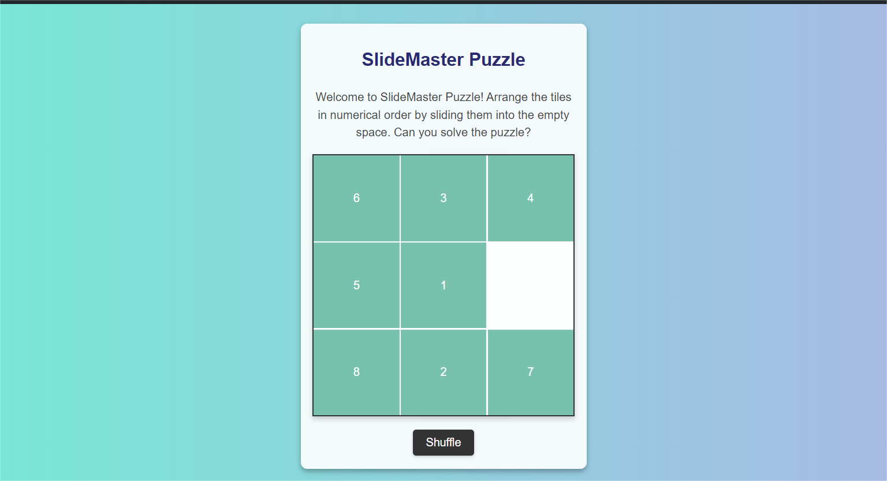

# SlideMaster Puzzle

## Description 📃
Welcome to SlideMaster Puzzle! This classic sliding puzzle game challenges you to arrange the tiles in numerical order by sliding them into the empty space. It's a simple yet addictive game that tests your problem-solving skills and patience. Can you solve the puzzle?

## Functionalities 🎮
- **Shuffle**: Randomly shuffle the tiles to start a new game.
- **Tile Movement**: Click on a tile adjacent to the empty space to move it.
- **Responsive Design**: The game adjusts to different screen sizes for optimal playability.
- **Visual Feedback**: Tiles animate when moved, providing visual feedback to the player.

## How to play? 🕹️
1. **Shuffle the Tiles**: Click the "Shuffle" button to start a new game with randomly shuffled tiles.
2. **Move the Tiles**: Click on any tile adjacent to the empty space to slide it into that space.
3. **Arrange in Order**: Continue sliding the tiles until all the tiles are in numerical order from 1 to 8, with the empty space in the bottom-right corner.

## Screenshots 📸
