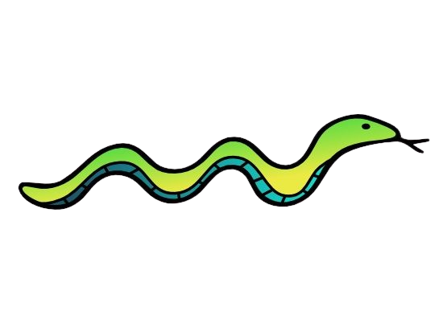

# **SnakeBites Game** 

---

 

## **Description 📃** 
- This project is built on a basic web tech stacks such as HTML, CSS and Javascript.
- This game is just for fun.

## **functionalities 🎮** 
- This game is a single player game.
- Using Up, Down, Left and Right Arrows, move the snake.
- By eating food, score will increase.
- High score will be updated when current score will be more than the high score.

## ** Additional Features **
- Displaying the current score and high score of the player.
- Implementing a graphical user interface (GUI) for a more interactive experience.
- Adding background sound and moving snake and eating food sounds.

 

## **How to play? 🕹️**
- This is a single player game.
- Using Up, Down, Left and Right Arrows, move the snake in such a way it does not touch the boundaries and also not the snake body.
- If head of the snake smash into their body and the boundaries, will result into **"GAME OVER"**
- By eating the food, score will increase.

 

## **Screenshots 📸**

 

 

## **Working video 📹**
<!-- add your working video over here -->

