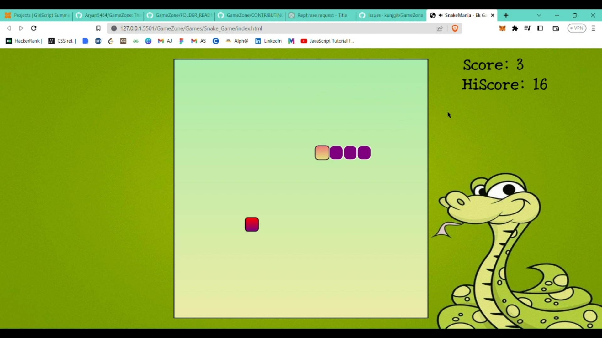

# **Snake_Game** 

---

 

## **Description 📃**
<!-- add your game description here  -->
- Experience the classic snake game on your mobile device! Control the slithering serpent, devour food to grow, and avoid obstacles. Simple touch controls, addictive gameplay, and vibrant visuals make this game a must-play. Challenge your reflexes and aim for the highest score in this timeless gaming adventure.

## **functionalities 🎮**
<!-- add functionalities over here -->
- Snake Movement
- Food Generation
- Snake 
- Obstacles
- Self-Collision Detection
- Score Tracking
- Level Progression
- High Score Recording
- Game Over Condition
- User Interface

 

## **How to play? 🕹️**
<!-- add the steps how to play games -->
- To initiate the game, simply press any key.
- The arrow keys will be used to control the movement of the snake.
- The screen will display food at random positions, and when the snake consumes it, its length will grow.
- d\Don't hit a wall and don't bite your own tail ie. Crashing into a wall or your tail will end the game immediately.
- Your high score is calculated based on the number of food the snake consumes.

 

## **Screenshots 📸**

 
<!--  -->

 

## **Working video 📹**
https://github.com/Aryan5464/GameZone/assets/111825539/817d42b4-68f7-4e63-8156-b092a37d325c

