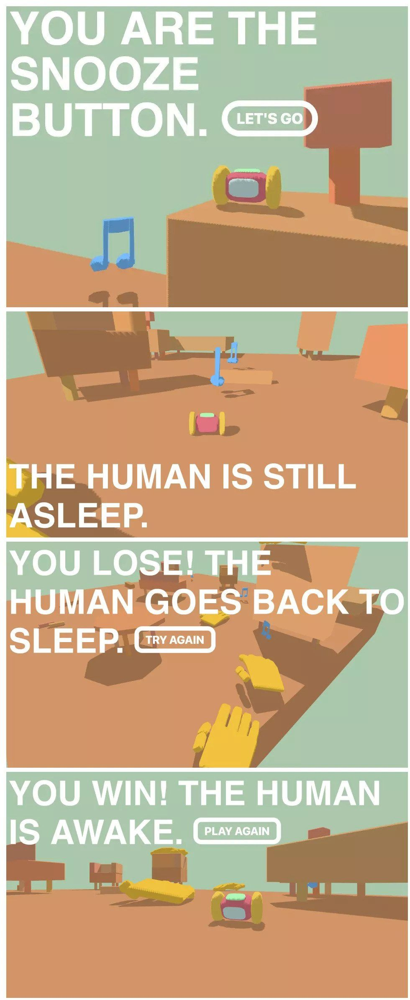

# **Snooze** 

---

 

## **Description 📃**
- The human is asleep, the human set the alarm but the human doesn’t like being woken up. 
- The human will try to hit the snooze button, You are the snooze button so the human will try to hit YOU!
- The human will try to delay the inevitable. Your job is to deliver the inevitable, to wake the human up.

## **functionalities 🎮**

- Movement + steering feels tuned well
- Color palette is very appealing
- 3D stylized aesthetic is very nice
- Incorporated humor in a charming way
- Little animation of the character rolling on jump and on finish
	
 

## **How to play? 🕹️**
- Instructions:
	- You play as an alarm clock on wheels. You keep moving forward at all times. 
	- Zoom around the apartment and collect musical notes which wake the human up. 
	- Avoid the human’s hands which try to press the snooze button — a single press will end the round. 
	- For some reason the hands are inexplicably big and even-more-inexplicably not attached to a body, and yet-even-more-inexplicably they fall out of the sky, but don’t worry too much about it.
- Controls:
	- Desktop: Arrows to turn left, right, and jump (up). Use the down arrow to tilt the camera a bit.
	- Mobile: Tap and hold to turn left and right. Tap and release to jump.
	
 

## **Screenshots 📸**

 

 
