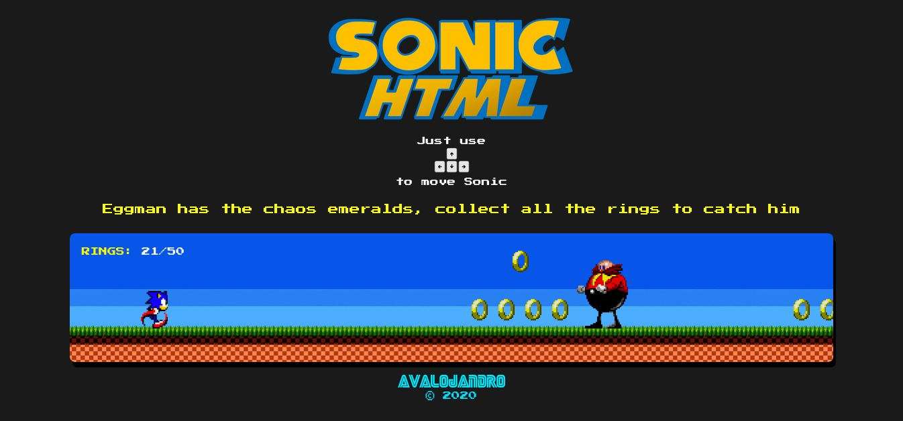

# **Sonic_The_Hedgehog** 

---

 

## **Description 📃**
- Sonic is a fast-paced platformer where players control the titular hedgehog as he runs, jumps, and rolls through levels at high speeds.
- Levels are typically filled with obstacles, enemies, and collectibles, and players must use Sonic's speed and abilities to navigate them and reach the end.
- Along the way, players will encounter Dr. Eggman, Sonic's arch-enemy, who will try to stop Sonic from completing his goals.

 

## **How to play? 🕹️**
- To play, simply hit left or right key to move Sonic around the screen. You can also jump by `up` key. 
- To dash, hit down key. Sonic will dash forward and destroy any obstacles in his path.
- Use your power-ups wisely. Power-ups can help you collect more rings, run faster, and jump higher.
- Collect coins. Coins can be used to unlock new characters and stages.
- Challenge your friends. See who can get the farthest in the game.
- As you play, you will collect rings, which can be used to purchase power-ups. 
- Power-ups can help you collect more rings, run faster, and jump higher. 
- You can also collect coins, which can be used to unlock new characters and stages.

 

## **Screenshots 📸**

 

 